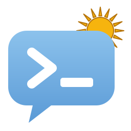

<p align="center">
  
</p>

<h1 align="center">VozLocal</h1>

<p align="center">
  <strong>Learn the Spanish Portenos actually speak, one terminal at a time.</strong><br />
  🇦🇷 Rioplatense Spanish, straight from the streets of Buenos Aires
</p>

<p align="center">
  
  
  
  
</p>

<p align="center">
  
</p>

VozLocal turns the moment you open a terminal into a tiny language lesson. It shows you a real, everyday phrase from Buenos Aires street Spanish, gives you a couple of seconds to guess what it means, and then reveals the translation. There's no app to open, no streak to keep up, and no account to create. It's just a steady drip of the slang, greetings and turns of phrase that textbooks leave out.

---

## 💡 Why VozLocal?

Classroom Spanish gets you through a hotel check-in. It won't help you when someone in Buenos Aires says *"Che, ¿vos querés ir al bondi o caminamos?"*

Rioplatense Spanish has its own grammar (*voseo*), its own slang (*lunfardo*) and a whole set of expressions you'll only pick up by hearing them over and over. VozLocal brings that repetition to the place many of us spend all day: the command line.

- **No extra effort.** It runs when you open a new terminal, so you don't have to remember to study.
- **Try to recall it first.** The phrase comes first and the translation follows after a pause, so you get a moment to work out the meaning yourself before you see it.
- **Doesn't get in your way.** It shows up at most once every 30 minutes by default. Opening ten tabs won't give you ten lessons.
- **Varied every day.** A different category leads each day, so it isn't the same kind of phrase every time.

---

## ✨ Features

### 🗣️ Curated local phrases
Out of the box, it has 37 phrases of Buenos Aires (*porteño*) Spanish across five categories:

| Category | What you'll learn | Example |
|---|---|---|
| **Greetings** | How people actually say hello | *¿Qué onda?* → What's up? |
| **Voseo** | The *vos* verb forms used across Argentina and Uruguay | *¿De dónde sos?* → Where are you from? |
| **Expressions** | Everyday reactions and fillers | *Ni ahí* → No way / not a chance |
| **Lunfardo** | Classic Buenos Aires slang | *Laburo* → Job / work |
| **Sample sentences** | The pieces put together in full sentences | *Qué quilombo se armó en el laburo.* → What a mess broke out at work. |

### ⏳ Reveal after a countdown
The phrase appears in bold colour. A row of dots then shrinks as the countdown runs, and the English translation replaces it. You get a clear moment to answer in your head before you see the answer.

### 📅 A different category each day
Each day has one featured category, and every category comes up once before any repeats. The order is reshuffled for every new cycle, so there's no fixed weekly pattern to get used to. The category stays the same all day. The phrase within it is picked at random each time.

### 🔁 Available on demand
Want another one? Type `voz` at any time for a new phrase from today's category.

### ✅ Mark phrases as learned
Know a phrase already? Type `yas` right after it appears and VozLocal won't pick it again. If you learn every phrase in a category, its phrases come back so you can keep reviewing.

### 🌍 Add your own regions
Phrases are stored as plain text files, one folder per region. To add Mexican slang, Castilian idioms or a whole new language, create a folder and a few files. You don't need to change any code.

### 🪶 Lightweight
It's a single zsh file that only uses standard tools: `zsh`, `awk`, `sleep` and `mkdir`. These are already on every Mac, and most Linux systems only need zsh added (see [Requirements](#requirements)). There's no Homebrew formula, no runtime and no network access.

---

## 📦 Installation

### Requirements

VozLocal needs **zsh**, plus a few standard command-line tools: `awk`, `sleep` and `mkdir`.

 **macOS:** everything is already installed. zsh has been the default shell since macOS Catalina (10.15). If you've switched to a different shell, switch back with:
```sh
chsh -s /bin/zsh
```

 **Linux:** `awk`, `sleep` and `mkdir` come with every standard distribution. zsh may need to be installed:

| Distribution | Command |
|---|---|
|   Debian / Ubuntu | `sudo apt install zsh` |
|   Fedora / RHEL | `sudo dnf install zsh` |
|  Arch | `sudo pacman -S zsh` |

Then make it your default shell with `chsh -s "$(command -v zsh)"`, log out, and log back in.

**Check your setup:**
```sh
zsh --version   # needs 5.0 or newer
```

### Install

**1. Download the project**
```sh
git clone https://github.com/lawrence-berry/VozLocal.git ~/VozLocal
```

**2. Load it from your `~/.zshrc`**
```sh
echo 'source ~/VozLocal/terminal/vozlocal.plugin.zsh' >> ~/.zshrc
```

**3. Open a new terminal.** Your first phrase will be waiting for you.

---

## 🚀 Usage

| Command | What it does |
|---|---|
| *(open a terminal)* | Shows a phrase automatically, at most once per interval |
| `voz` | Shows a new phrase from today's category straight away |
| `yas` | Marks the last phrase shown as learned, so it stops coming up |

---

## ⚙️ Configuration

Everything is optional. Set these in your `~/.zshrc` **before** the `source` line:

| Variable | Default | Description |
|---|---|---|
| `VOZLOCAL_REGION` | `es_AR` | Which folder under `terminal/data/` to read phrases from |
| `VOZLOCAL_DELAY` | `2` | Seconds to wait before showing the translation. Use `0` to show it straight away |
| `VOZLOCAL_INTERVAL` | `30` | Minimum minutes between automatic phrases. Use `0` to show one in every new shell |

For example, for a longer pause and a phrase in every new tab:
```sh
export VOZLOCAL_DELAY=4
export VOZLOCAL_INTERVAL=0
source ~/VozLocal/terminal/vozlocal.plugin.zsh
```

---

## ✍️ Adding phrases and regions

Each category is a pipe-separated (`.psv`) file with a header row:

```
phrase|translation
Bondi|Bus
Fiaca|Laziness (tengo fiaca = I don't feel like doing anything)
```

- **Add a phrase:** add a line to any `.psv` file.
- **Add a category:** add a new `.psv` file. It joins the daily rotation automatically.
- **Add a region:** create `terminal/data/<region>/` with its own `.psv` files, then set `VOZLOCAL_REGION=<region>`.

The pipe character was chosen because phrases often contain commas (*"Dale, nos vemos en un rato."*). With a pipe, the files stay readable and need no quoting.

---

## 🔧 Under the hood

VozLocal is small, but it's written like it will run inside someone else's shell, because it does.

- **Won't break your shell.** Because VozLocal is sourced into your interactive session, every function starts with `emulate -L zsh`. Your own options (`KSH_ARRAYS`, `NO_UNSET` and others) can't change how it behaves, and its settings don't leak back into your shell.
- **Checks its inputs.** zsh evaluates arithmetic expressions, so a bad value in `$(( ))` could run commands. Every setting and the saved timestamp are checked as whole numbers first. Anything else is ignored, and the default is used instead.
- **Stays out of scripts.** Phrases only appear automatically in interactive terminals, so scripts that source your `.zshrc` stay quiet.
- **Recovers from interruptions.** Pressing Ctrl-C during the countdown clears the line and exits with the standard status code `130`.
- **Copes with messy data.** Blank lines and lines without a separator are skipped.
- **Keeps the daily order stable.** The daily category comes from a Fisher–Yates shuffle seeded by the current cycle number. Every shell on your machine agrees on today's category, and no state has to be stored.
- **Uses few processes.** It reads the time from zsh's built-in `$EPOCHSECONDS` rather than starting `date`. Its state lives in `$XDG_CACHE_HOME` (default `~/.cache/vozlocal/`): one timestamp, the last phrase shown, and the list of learned phrases. Delete the `learned` file there to start over.

---

## 🧪 Testing

The test suite is plain zsh, so there's nothing to install:

```sh
zsh terminal/tests/run.zsh
```

It runs 22 checks in about 8 seconds. They cover the phrase-and-reveal flow, marking phrases as learned, the daily category rotation, automatic display in real (pseudo-terminal) shells, Ctrl-C handling, command-injection attempts through settings and the timestamp file, and the format of every shipped phrase file. It exits with a non-zero status if anything fails, so it can go straight into CI.

---

## 🗺️ Roadmap

VozLocal starts in the terminal, but it's designed to reach you wherever you are.

- **🌐 Chrome new tab page.** A browser extension that shows the day's phrase every time you open a new tab, using the same phrase data and daily rotation as the terminal.
- **📱 Add phrases from your phone.** Heard a new expression in a café? Save it on the spot. It will show up in your terminal and browser, backed by a shared phrase database.
- ** Speach mode? **

---

<p align="center">
  <br />
  <em>¡Dale, a practicar!</em> 🇦🇷
</p>
