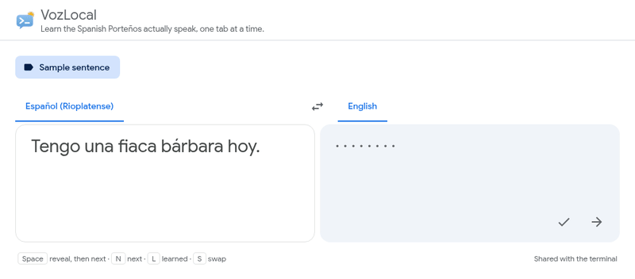
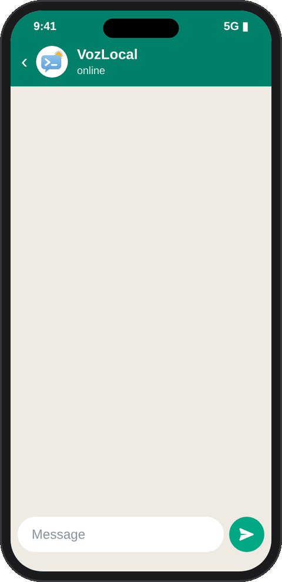
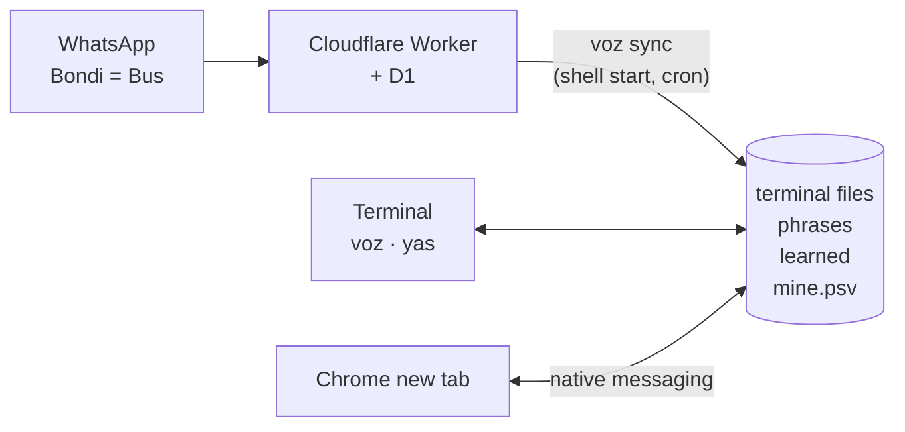

<p align="center">
  
</p>

<h1 align="center">VozLocal</h1>

<p align="center">
  <strong>Learn the Spanish Porteños actually speak, one terminal at a time.</strong><br />
  🇦🇷 Rioplatense Spanish, straight from the streets of Buenos Aires
</p>

<p align="center">
  
  
  
  
</p>

<p align="center">
  
</p>

Textbook Spanish won't help when someone in Buenos Aires says *"Che, ¿vos querés ir al bondi o caminamos?"* VozLocal teaches the slang (*lunfardo*), the *vos* verb forms and the everyday expressions by repetition, in the places you already spend your day. A phrase appears, you get a moment to recall its meaning, and then the translation is revealed. There's no app to open, no streak to keep, and nothing leaves your machine unless you set up the bot.

It ships with 37 phrases in five categories (greetings, *voseo*, expressions, *lunfardo* and full sentences), and you can add your own.

## Three parts, one set of phrases

| Part | What it does | Built with |
|---|---|---|
| [**Terminal**](terminal/README.md) | A phrase when you open a terminal, with `voz` for another and `yas` to mark one as learned | zsh |
| [**Chrome new tab**](chrome/README.md) | The same phrases in every new tab, laid out like Google Translate | Manifest V3 extension, native messaging |
| [**WhatsApp bot**](bot/README.md) | Text `Bondi = Bus` to your bot, reply `yes`, and the phrase joins your rotation | Cloudflare Worker, D1, WhatsApp Cloud API |

<p align="center">
  
  &nbsp;
  
</p>



The terminal's files are the single source of truth. Mark a phrase as learned in either place and it stops appearing in both. Phrases from WhatsApp sync when a terminal opens, with a macOS notification when new ones arrive. With the optional cron job (`voz install-cron`), they arrive within two minutes even with no terminal open.

## Quick start

```sh
git clone https://github.com/lawrence-berry/VozLocal.git ~/VozLocal
echo 'source ~/VozLocal/terminal/vozlocal.plugin.zsh' >> ~/.zshrc
```

Open a new terminal. To add the Chrome extension, see [chrome/README.md](chrome/README.md). The bot is optional and self-hosted; see [bot/README.md](bot/README.md).

## Engineering highlights

- **Safe inside your shell.** The plugin runs inside your own shell, so your options and aliases can't change its behaviour. Every setting is checked as a plain number, so a bad value can't run code, and Ctrl-C is handled cleanly.
- **Untrusted input handled carefully.**
  - The bot verifies Meta's HMAC signature over the raw request bytes.
  - It answers only allowed numbers, and handles each message once despite webhook retries.
  - The bot refuses phrases with hidden or control characters, and the terminal and Chrome drop any that get through.
- **A browser talking to local files.** Chrome extensions can't read files, so a small zsh program speaks Chrome's native messaging protocol. It shares a file lock with the terminal.
- **Resilient sync.**
  - Marks made while Chrome can't reach the terminal are queued and replayed.
  - A new tab never waits more than 0.4 s for the terminal.
  - An optional cron job keeps phrases flowing when no terminal is open.
- **No secrets in a public repo.** Tokens live outwith this repo and in Cloudflare, and examples use reserved, fictional numbers.

## Tests

| Part | Command | Checks |
|---|---|---|
| Terminal | `zsh terminal/tests/run.zsh` | 88, in plain zsh, including real pseudo-terminal shells |
| Bot | `node --test bot/test` | 19, against Node's built-in SQLite with the real migration (Node 22.5 or newer) |
| Chrome logic | `cd chrome && node --test test` | 21, on picking phrases and reading the terminal's replies |
| Chrome in the browser | `chrome/bin/dev bundle exec rspec` | 32 RSpec specs, most of them Playwright specs that load the real extension and its native host in Chromium, in Docker |

## Roadmap

- ** Speach mode? **
- **Directory layouts as images:** show most of them as a picture of the tree rather than as text.

<p align="center">
  <br />
  <em>¡Dale, a practicar!</em> 🇦🇷
</p>
