# VozLocal in the terminal

A zsh plugin that shows a Rioplatense Spanish phrase when you open a terminal, counts down, then reveals the translation.

<p align="center">
  
</p>

## Install

It needs **zsh 5.0 or newer**, plus `awk`, `sleep` and `mkdir`, and `curl` if you use the bot.
- **macOS:** all of these come with the system. zsh has been the default shell since Catalina (10.15).
- **Linux:** the tools come with every standard distribution, but you may need to install zsh: `sudo apt install zsh`, `sudo dnf install zsh` or `sudo pacman -S zsh`. Then make it your shell with `chsh -s "$(command -v zsh)"`.

```sh
git clone https://github.com/lawrence-berry/VozLocal.git ~/VozLocal
echo 'source ~/VozLocal/terminal/vozlocal.plugin.zsh' >> ~/.zshrc
```

Open a new terminal, and your first phrase is waiting.

## Commands

| Command | What it does |
|---|---|
| *(open a terminal)* | Shows a phrase, at most once per `VOZLOCAL_INTERVAL` |
| `voz` | Shows another phrase from today's category |
| `yas` | Marks the last phrase as learned, so it stops coming up |
| `voz sync` | Fetches phrases confirmed in the [WhatsApp bot](../bot/README.md). It also runs in the background when a terminal opens, and on macOS a notification shows what arrived |
| `voz install-chrome` | Lets the [Chrome extension](../chrome/README.md) share learned phrases and WhatsApp phrases with the terminal. Run it again if you move the repo |
| `voz install-cron` | Runs `voz sync` every 2 minutes, so WhatsApp phrases reach Chrome with no terminal open. Output goes to `~/.cache/vozlocal/cron.log`. macOS may ask you to allow the change the first time |

Both `install-` commands take `--remove` to undo them.

Each day features one category, and every category comes up once before any repeats. The order is reshuffled each cycle. `voz` never shows the same phrase twice in a row. Learned phrases come back only when a category has nothing else left.

## Settings

All of these are optional. Set them in `~/.zshrc` **before** the `source` line:

| Variable | Default | What it does |
|---|---|---|
| `VOZLOCAL_REGION` | `es_AR` | Which folder under `data/` to read |
| `VOZLOCAL_DELAY` | `2` | Seconds before the translation appears. `0` shows it at once |
| `VOZLOCAL_INTERVAL` | `30` | Minimum minutes between automatic phrases. `0` shows one in every new shell |
| `VOZLOCAL_BOT_URL` | *(unset)* | Your WhatsApp bot's address. Leave it unset to stay fully offline |
| `VOZLOCAL_BOT_TOKEN` | *(unset)* | The bot's `SYNC_TOKEN`. Keep it in `~/.secrets/vozlocal.zsh`, not `~/.zshrc` ([SETUP.md section 13](../bot/SETUP.md#13-point-the-terminal-at-the-bot)) |
| `VOZLOCAL_SYNC_INTERVAL` | `60` | Minimum minutes between background syncs when a terminal opens |
| `VOZLOCAL_NOTIFY` | `1` | `0` turns off the macOS notification for new phrases |
| `NO_COLOR` | *(unset)* | Set it to anything to turn off colour ([no-color.org](https://no-color.org)) |

For example, for a longer pause and a phrase in every new shell:

```sh
export VOZLOCAL_DELAY=4
export VOZLOCAL_INTERVAL=0
source ~/VozLocal/terminal/vozlocal.plugin.zsh
```

## Phrases and regions

Each category is a pipe-separated (`.psv`) file with a header row, in `data/<region>/`:

```
phrase|translation
Bondi|Bus
Fiaca|Laziness (tengo fiaca = I don't feel like doing anything)
```

- **A new phrase:** add a line to any file.
- **A new category:** add a file. It joins the daily rotation by itself.
- **A new region:** add a folder and set `VOZLOCAL_REGION`.
- **Your WhatsApp phrases** go to `mine.psv`. It isn't a category: its phrases join whichever category is on today. It's gitignored, so your phrases stay on your machine.
- **After editing a shipped file,** run `chrome/bin/dev bin/build-data` so the Chrome extension's copy matches. A Chrome spec fails if you forget.

The pipe separator was chosen because phrases often contain commas (*"Dale, nos vemos en un rato."*).

## How it's built

It's sourced into your interactive shell, so it's written to stay out of the way:

- **Your shell options don't affect it.** Its commands run under `emulate -L zsh`, so options like `KSH_ARRAYS` or `NO_UNSET` don't change its behaviour, and its own settings don't leak out. It's parsed with aliases off, so an `alias mv='mv -i'` can't change its commands.
- **It checks its inputs.** zsh runs code inside `$(( ))`, so every setting and saved timestamp is checked as a whole number first.
- **It stays quiet in scripts.** Phrases appear automatically only in interactive terminals.
- **It handles Ctrl-C.** Ctrl-C during the countdown clears the line and returns `130`.
- **It agrees on the day's category without storing it.** A Fisher–Yates shuffle seeded by the cycle number gives every shell the same category.
- **Syncing is safe.**
  - `voz sync` runs in the background behind a file lock, which the kernel releases if a sync is killed.
  - The token reaches `curl` on stdin, not the command line.
  - Rows with control characters, bidi or zero-width marks, or invalid UTF-8 are dropped.
  - A failed sync leaves `mine.psv` as it was.
  - New phrases from a background or cron sync post a macOS notification. The phrase reaches `osascript` as an argument, never as part of the script, so it can't run anything. macOS lists these notifications under Script Editor, so allow notifications for Script Editor in System Settings if none appear.
- **It shares state with Chrome.** `vozlocal-host` is a Chrome native messaging host written in zsh. It reads and writes the learned file under a lock that `yas` shares. It only touches regular files, so a FIFO can't hang it.
- **State** lives in `$XDG_CACHE_HOME/vozlocal/` (by default `~/.cache/vozlocal/`). Delete `learned` there to start over.

## Tests

```sh
zsh terminal/tests/run.zsh
```
